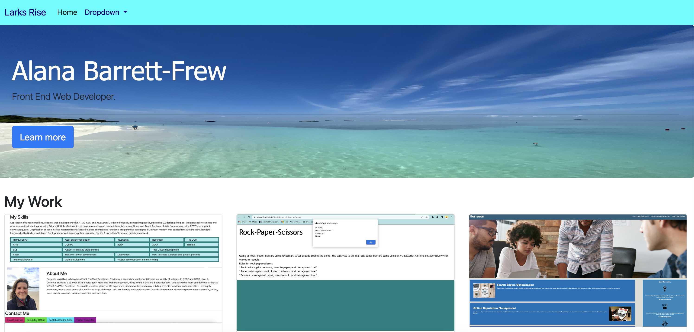
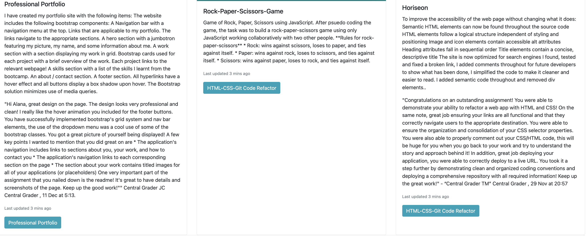
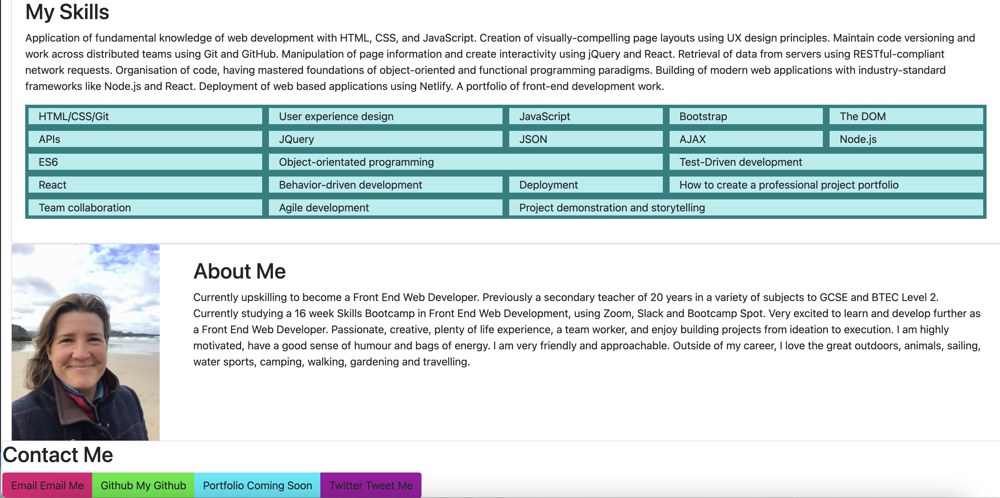

# Bootstrap-Portfolio

## Description

  Using Bootstrap, I recreated my first portfolio site with the following items:

  The website includes the following bootstrap components:

  A Navigation bar with a navigation menu at the top. 

  Links that are applicable to my portfolio. The links navigate to the appropriate sections. 

  A hero section with a jumbotron featuring my picture, my name, and some information about me.

  A work section with a section displaying my work in grid. Bootstrap cards used for each project with a brief overview of the work. Each project links to the relevant webpage!

  A skills section with a list of the skills I learnt from the bootcamp.

  An about / contact section.
    
  A footer section. All hyperlinks have a hover effect and all buttons display a box shadow upon hover.

The Bootstrap solution minimizes use of media queries.

https://alanabf.github.io/Bootstrap-Portfolio/  

## Installation

N/A

## Usage

The webpage is a Portfolio giving users an insight into me and what I do. The page demonstrates my skills and is constantly updated to showcase my best work. 

## Credits

N/A

## License

MIT

--- 
